# mental-health-in-tech-analysis
Analysis based on Mental Health in Tech Survey Dataset 2014 by Open Sourcing Mental Illness, LTD

## About the data
#### Mental Health in Tech Survey
Survey on Mental Health in the Tech Workplace in 2014 ([Link](https://www.kaggle.com/osmi/mental-health-in-tech-survey))
  
This dataset contains the following data:  
1. `Timestamp`  
2. `Age`  
3. `Gender`  
4. `Country`  
5. `state`: If you live in the United States, which state or territory do you live in?  
6. `self_employed`: Are you self-employed?  
7. `family_history`: Do you have a family history of mental illness?  
8. `treatment`: Have you sought treatment for a mental health condition?  
9. `work_interfere`: If you have a mental health condition, do you feel that it interferes with your work?  
10. `no_employees`: How many employees does your company or organization have?  
11. `remote_work`: Do you work remotely (outside of an office) at least 50% of the time?  
12. `tech_company`: Is your employer primarily a tech company/organization?  
13. `benefits`: Does your employer provide mental health benefits?  
14. `care_options`: Do you know the options for mental health care your employer provides?  
15. `wellness_program`: Has your employer ever discussed mental health as part of an employee wellness program?  
16. `seek_help`: Does your employer provide resources to learn more about mental health issues and how to seek help?  
17. `anonymity`: Is your anonymity protected if you choose to take advantage of mental health or substance abuse treatment resources?  
18. `leave`: How easy is it for you to take medical leave for a mental health condition?  
19. `mentalhealthconsequence`: Do you think that discussing a mental health issue with your employer would have negative consequences?  
20. `physhealthconsequence`: Do you think that discussing a physical health issue with your employer would have negative consequences?  
21. `coworkers`: Would you be willing to discuss a mental health issue with your coworkers?  
22. `supervisor`: Would you be willing to discuss a mental health issue with your direct supervisor(s)?  
23. `mentalhealthinterview`: Would you bring up a mental health issue with a potential employer in an interview?  
24. `physhealthinterview`: Would you bring up a physical health issue with a potential employer in an interview?  
25. `mentalvsphysical`: Do you feel that your employer takes mental health as seriously as physical health?  
26. `obs_consequence`: Have you heard of or observed negative consequences for coworkers with mental health conditions in your workplace?  
27. `comments`: Any additional notes or comments    
  
  
## Analysing the data
* There are multiple `Gender` values present in the data - categorized all values into three categories - Male, Female, Others  
* There are multiple negative values in the `Age` column. Kept records with age greater than 18 and less than 100  

**What are the demographics of the respondents?** 
The respondents in the survey data set consists of 78.8% males, 19.6% females, and 1.6% others. Majority of the respondents belong to age group 30-39 years covering 44% of the data, followed by 20-29 years with 39.4%. 8-19 years (1.7%) and 50-59 years (2%) have very less number of respondents. 
| Age   | Percentage |
|-------|------------|
| 30-39 | 44.28%     |
| 20-29 | 39.49%     |
| 40-49 | 11.91%     |
| 50-59 | 2.08%      |
| 18-19 | 1.76%      |
| > 60  | 0.48%      |  

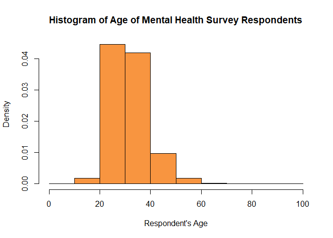<!-- -->  

  
**Which countries and states, maximum respondents are belonging to? With whom are employees more likely to talk about their mental health conditions at workplace?**  
About 85% of the data from this survey is centered on the following 4 countries: United States, United Kingdom, Canada, and Germany. If we take a deeper look into the US, most of the data comes from California (44%), Washington (22%), New York (18%), and Tennessee (14%).  All these States have one thing in common, most employees would prefer to open up to their supervisors, rather than to their coworkers. This shows that direct channels of communication between supervisors and their subordinates are essential to encourage conversation surrounding mental health at the workplace.   
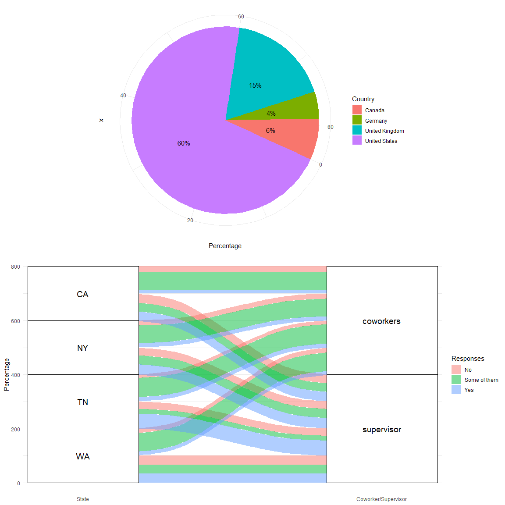   
  

**How do tech companies fare against non-tech companies in mental health support?**   
In terms of comparison per industry, non-tech companies are well-placed to tackle employee's mental health. People working in non-tech are more open to treatment of mental health issues(54% against 50% from tech). Also, non-tech companies have better mental health support package (benefits, guidance and wellness programs). However, even after having less mental health support, tech employees are more vocal at expressing their mental health issues with their supervisors and coworkers. This may be a result given that the technology industry is targeted towards the younger generations who have been exposed to more open environments and therefore are generally more willing to share personal experiences.  
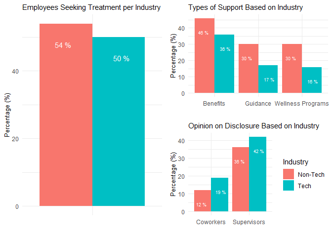  

**How are the survey responses correlated with each other? What are the factors impacting employees getting treatment for their mental health?**  
There is a relatively high correlation between wellness_program and seek_help, which suggests that people are more likely to seek help if the employers discuss mental health in the workplace as part of their wellness programs. Also, if an employee feels safe disclosing their mental health condition with their supervisor, they will most likely feel safe sharing it with their coworkers.    
Additionally, when it comes to seeking help, it is evident that people who have some kind of history of mental health conditions in their families, as well as those whom their employers provide mental health care options, are more likely to seek treatment.  
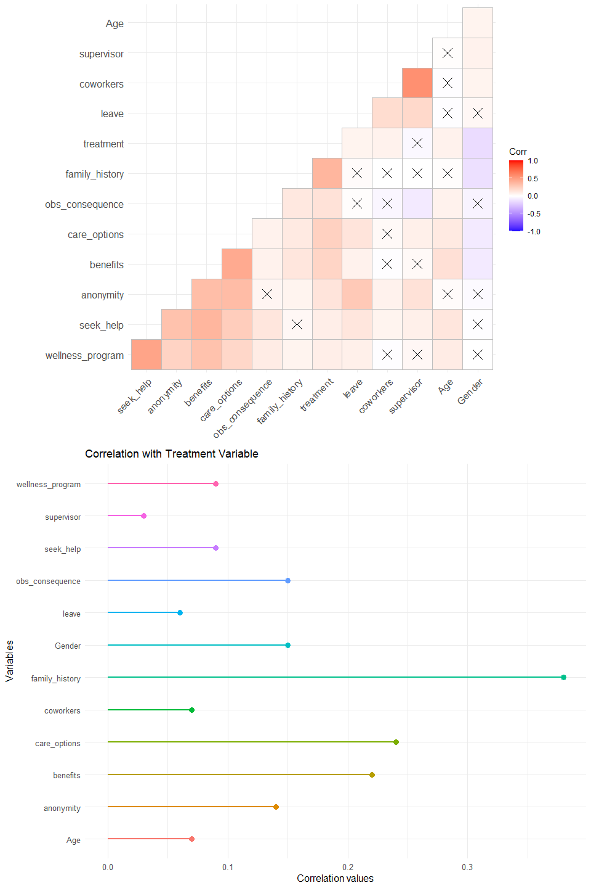  

**Does company size play a role in the availability of mental help support for employees?**  
If we look into the breakdown of respondents based on company size, 59% of the respondents work in small companies (< 100 employees) and 41% work in large companies (>100 employees). When it comes to seeking treatment, 52% of employees in large companies ought treatment against 50% in small companies.    
Since employees seek the same amount of treatment regardless of the size of the company, we can draw a direct comparison about which size of company offers more support. When it comes to small companies, most employees have access to anonymity and benefits. Meanwhile in large companies, most employees receive mental health benefits. Therefore, it is fair to say that smaller companies care more about the well-being of their employees. 
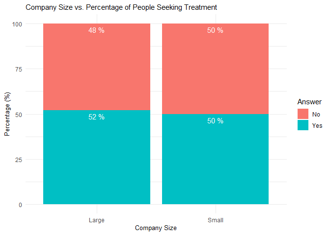  
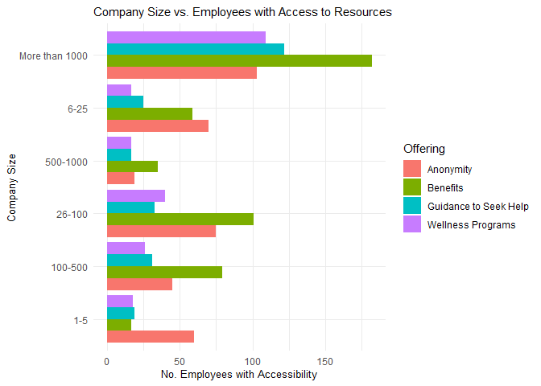  

**Is mental health more stigmatized in companies that do not provide the benefits?**  
As expected, companies where no benefits are offered to employees tend to view mental health problems negatively and consequences are more frequent. On the other hand, in the companies where mental health is not even acknowledged, consequences are less frequent. However, it can be implied that since people are not encouraged to share their experiences, there are less scenarios in which a mental health condition is shared in the workplace, which may lead to erroneous less frequent observance of consequences.  
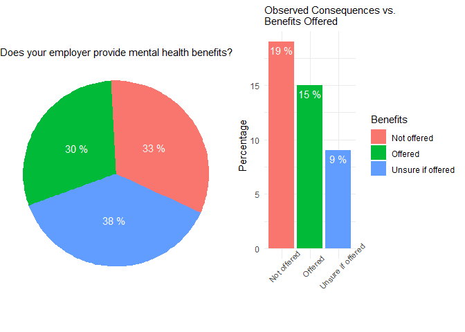  

**Are employees more likely to talk about Mental health or Physical health conditions in an interview?**  
Workplace geographic location does not have much of an effect on the respondents’ sentiment towards sharing their mental or physical health conditions in an interview. However, it is important to note that while a small number of people would share their physical health issues, almost none would discuss their mental health problems. This shows that there is still a stigma placed on mental health conditions and a long way for them to be treated with the same weight as physical conditions. 
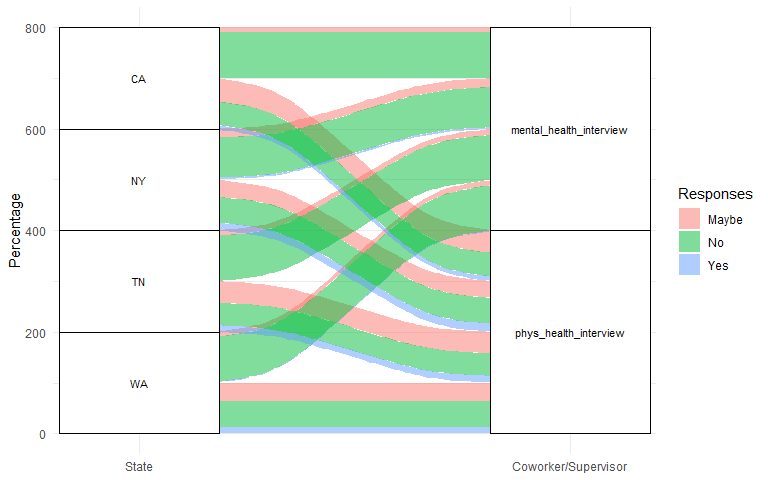<!-- -->  

**What is change in attitude of employee and employers on mental health over years? (2014, 2016, 2019)**   
In this section, analysis of the change of the following variables was made:   
`seek_help`: *Does your employer provide resources to learn more about mental health issues and how to seek help?*  
`mentalvsphysical`: *Do you feel that your employer takes mental health as seriously as physical health?*  
`treatment`: *Have you sought treatment for a mental health condition?*   

Over the span of 5 years, there is significant decrease in people directly saying no - employers not providing resources, showing that there is lack of awareness even if employers would have introduced resources for the mental health. On the contrary, employers have started giving less priority to mental health with 4% decline in people agreeing with their employer's consideration of mental health.    
Whereas, employees have started giving more importance to treatment in 2016 with rise of close to 7% from 2014. This indicates that there is increased awareness among employees about mental health over the period of 5 years.  
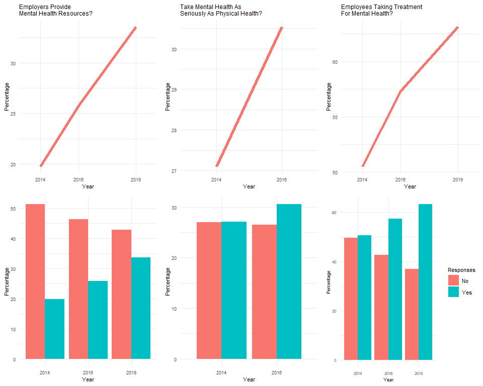  

**What were the sentiments of the respondents in the comments?**
The most common words from the comment section are health, mental, and employer, which are neutral. The sentiment towards mental health is mostly negative regardless of gender and age groups, with the exception of the age group 18-20 who had a brighter view on said issue. 
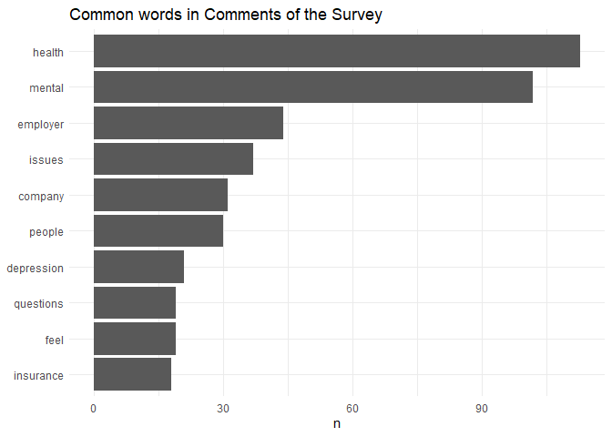<!-- -->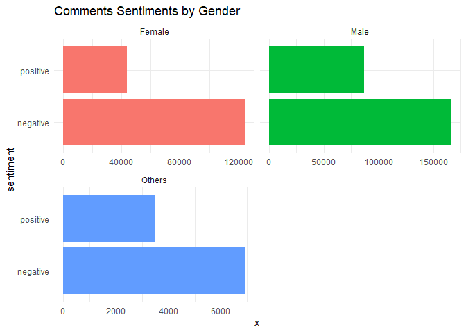<!-- -->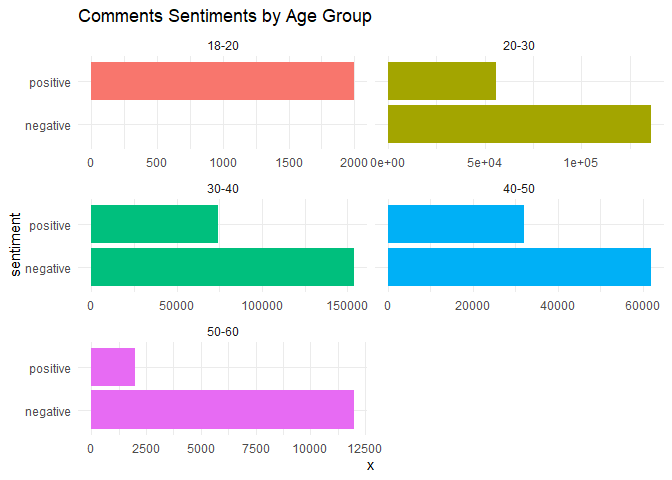<!-- -->  

**What were the most frequently used negative and positive words in the comments?**
The frequently used negative words in the comments are `issues`, `depression`, `anxiety`, `negative`, etc. whereas the positive words are `benefits`, `supportive`, `comfortable`, `support`, etc.  
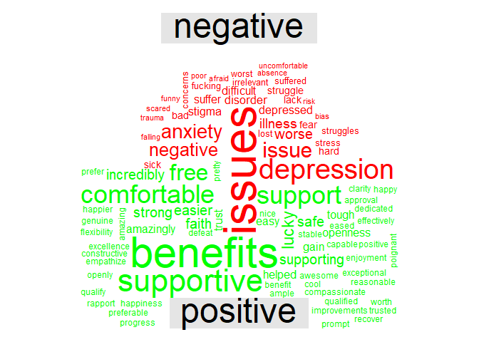  

