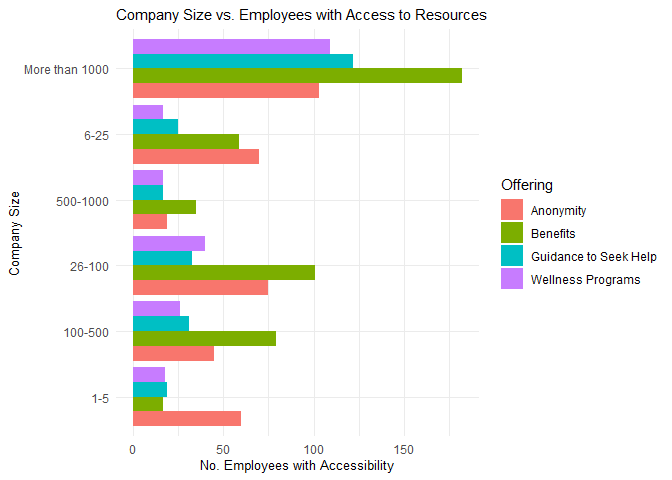
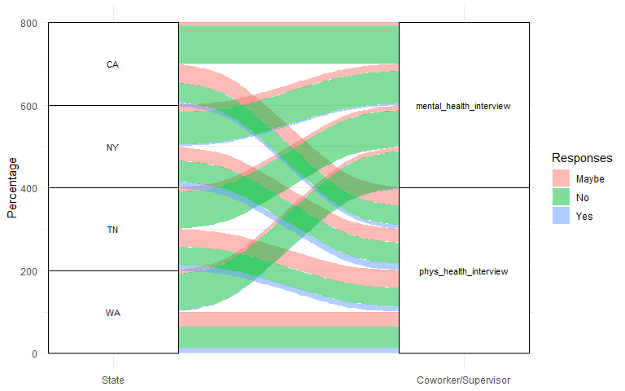

Mental Health In Tech
================
Vasundhara Sharma
2/18/2022

## About the data

#### Mental Health in Tech Survey

Survey on Mental Health in the Tech Workplace in 2014
[Link](https://www.kaggle.com/osmi/mental-health-in-tech-survey)

This dataset contains the following data:  
1. `Timestamp`  
2. `Age`  
3. `Gender`  
4. `Country`  
5. `state`: If you live in the United States, which state or territory
do you live in?  
6. `self_employed`: Are you self-employed?  
7. `family_history`: Do you have a family history of mental illness?  
8. `treatment`: Have you sought treatment for a mental health
condition?  
9. `work_interfere`: If you have a mental health condition, do you feel
that it interferes with your work?  
10. `no_employees`: How many employees does your company or organization
have?  
11. `remote_work`: Do you work remotely (outside of an office) at least
50% of the time?  
12. `tech_company`: Is your employer primarily a tech
company/organization?  
13. `benefits`: Does your employer provide mental health benefits?  
14. `care_options`: Do you know the options for mental health care your
employer provides?  
15. `wellness_program`: Has your employer ever discussed mental health
as part of an employee wellness program?  
16. `seek_help`: Does your employer provide resources to learn more
about mental health issues and how to seek help?  
17. `anonymity`: Is your anonymity protected if you choose to take
advantage of mental health or substance abuse treatment resources?  
18. `leave`: How easy is it for you to take medical leave for a mental
health condition?  
19. `mentalhealthconsequence`: Do you think that discussing a mental
health issue with your employer would have negative consequences?  
20. `physhealthconsequence`: Do you think that discussing a physical
health issue with your employer would have negative consequences?  
21. `coworkers`: Would you be willing to discuss a mental health issue
with your coworkers?  
22. `supervisor`: Would you be willing to discuss a mental health issue
with your direct supervisor(s)?  
23. `mentalhealthinterview`: Would you bring up a mental health issue
with a potential employer in an interview?  
24. `physhealthinterview`: Would you bring up a physical health issue
with a potential employer in an interview?  
25. `mentalvsphysical`: Do you feel that your employer takes mental
health as seriously as physical health?  
26. `obs_consequence`: Have you heard of or observed negative
consequences for coworkers with mental health conditions in your
workplace?  
27. `comments`: Any additional notes or comments

## Analysing the data

``` r
# reading the file
df_mental_health <- read.csv('mental-health-survey.csv', na.strings = c('', 'NA'), stringsAsFactors = T)
head(df_mental_health) # checking the dataset
```

    ##             Timestamp Age Gender        Country state self_employed
    ## 1 2014-08-27 11:29:31  37 Female  United States    IL          <NA>
    ## 2 2014-08-27 11:29:37  44      M  United States    IN          <NA>
    ## 3 2014-08-27 11:29:44  32   Male         Canada  <NA>          <NA>
    ## 4 2014-08-27 11:29:46  31   Male United Kingdom  <NA>          <NA>
    ## 5 2014-08-27 11:30:22  31   Male  United States    TX          <NA>
    ## 6 2014-08-27 11:31:22  33   Male  United States    TN          <NA>
    ##   family_history treatment work_interfere   no_employees remote_work
    ## 1             No       Yes          Often           6-25          No
    ## 2             No        No         Rarely More than 1000          No
    ## 3             No        No         Rarely           6-25          No
    ## 4            Yes       Yes          Often         26-100          No
    ## 5             No        No          Never        100-500         Yes
    ## 6            Yes        No      Sometimes           6-25          No
    ##   tech_company   benefits care_options wellness_program  seek_help  anonymity
    ## 1          Yes        Yes     Not sure               No        Yes        Yes
    ## 2           No Don't know           No       Don't know Don't know Don't know
    ## 3          Yes         No           No               No         No Don't know
    ## 4          Yes         No          Yes               No         No         No
    ## 5          Yes        Yes           No       Don't know Don't know Don't know
    ## 6          Yes        Yes     Not sure               No Don't know Don't know
    ##                leave mental_health_consequence phys_health_consequence
    ## 1      Somewhat easy                        No                      No
    ## 2         Don't know                     Maybe                      No
    ## 3 Somewhat difficult                        No                      No
    ## 4 Somewhat difficult                       Yes                     Yes
    ## 5         Don't know                        No                      No
    ## 6         Don't know                        No                      No
    ##      coworkers supervisor mental_health_interview phys_health_interview
    ## 1 Some of them        Yes                      No                 Maybe
    ## 2           No         No                      No                    No
    ## 3          Yes        Yes                     Yes                   Yes
    ## 4 Some of them         No                   Maybe                 Maybe
    ## 5 Some of them        Yes                     Yes                   Yes
    ## 6          Yes        Yes                      No                 Maybe
    ##   mental_vs_physical obs_consequence comments
    ## 1                Yes              No     <NA>
    ## 2         Don't know              No     <NA>
    ## 3                 No              No     <NA>
    ## 4                 No             Yes     <NA>
    ## 5         Don't know              No     <NA>
    ## 6         Don't know              No     <NA>

``` r
# checking the unique values in the Gender column
unique(df_mental_health$Gender)
```

    ##  [1] Female                                        
    ##  [2] M                                             
    ##  [3] Male                                          
    ##  [4] male                                          
    ##  [5] female                                        
    ##  [6] m                                             
    ##  [7] Male-ish                                      
    ##  [8] maile                                         
    ##  [9] Trans-female                                  
    ## [10] Cis Female                                    
    ## [11] F                                             
    ## [12] something kinda male?                         
    ## [13] Cis Male                                      
    ## [14] Woman                                         
    ## [15] f                                             
    ## [16] Mal                                           
    ## [17] Male (CIS)                                    
    ## [18] queer/she/they                                
    ## [19] non-binary                                    
    ## [20] Femake                                        
    ## [21] woman                                         
    ## [22] Make                                          
    ## [23] Nah                                           
    ## [24] All                                           
    ## [25] Enby                                          
    ## [26] fluid                                         
    ## [27] Genderqueer                                   
    ## [28] Female                                        
    ## [29] Androgyne                                     
    ## [30] Agender                                       
    ## [31] cis-female/femme                              
    ## [32] Guy (-ish) ^_^                                
    ## [33] male leaning androgynous                      
    ## [34] Male                                          
    ## [35] Man                                           
    ## [36] Trans woman                                   
    ## [37] msle                                          
    ## [38] Neuter                                        
    ## [39] Female (trans)                                
    ## [40] queer                                         
    ## [41] Female (cis)                                  
    ## [42] Mail                                          
    ## [43] cis male                                      
    ## [44] A little about you                            
    ## [45] Malr                                          
    ## [46] p                                             
    ## [47] femail                                        
    ## [48] Cis Man                                       
    ## [49] ostensibly male, unsure what that really means
    ## 49 Levels: A little about you Agender All Androgyne ... Woman

``` r
# converting the column values to lowercase
df_mental_health$Gender <- tolower(df_mental_health$Gender)
```

``` r
# defining lists on the basis of unique values present in the dataset
male <- c('male-ish', 'cis male', 'male (cis)', 'make', 'mail', 'ostensibly male, unsure what that really means', 'm', 'maile', 'male ', 'msle', 'mal', 'man', 'malr', 'cis man', 'male')
female <- c('female', 'female ', 'female (cis)', 'woman', 'cis female', 'cis-female/femme', 'femail', 'f', 'femake')
others <- c('p', 'nah', 'all', 'a little about you', 'genderqueer', 'non-binary', 'trans woman', 'androgyne', 'neuter', 'trans-female', 'agender', 'female (trans)', 'something kinda male?', 'enby', 'guy (-ish) ^_^', 'queer', 'queer/she/they', 'male leaning androgynous', 'fluid', 'genderqueer', 'non-binary', 'trans woman', 'androgyne', 'neuter', 'trans-female', 'agender', 'female (trans)', 'something kinda male?', 'enby', 'guy (-ish) ^_^', 'queer', 'queer/she/they', 'male leaning androgynous', 'fluid')

# replace the values in the data set so that the categories are consistent
df_mental_health <- df_mental_health %>% mutate(Gender = replace(Gender, which(Gender %in% male), 'Male'),
                                                Gender = replace(Gender, which(Gender %in% female), 'Female'),
                                                Gender = replace(Gender, which(Gender %in% others), 'Others'))

# checking if all values are covered and category is consistent                                                
unique(df_mental_health$Gender)
```

    ## [1] "Female" "Male"   "Others"

``` r
# age values has some negative values and values over 100
# keeping rows with age between 18 and 100
df_mental_health <- df_mental_health %>% filter(Age >= 18 & Age < 100)
```

``` r
# checking the summary of the Age column
summary(df_mental_health$Age)
```

    ##    Min. 1st Qu.  Median    Mean 3rd Qu.    Max. 
    ##   18.00   27.00   31.00   32.08   36.00   72.00

``` r
# plotting histogram to check the age distribution of the respondents
hist(df_mental_health$Age, 
     xlab = "Respondent's Age", 
     main = "Histogram of Age of Mental Health Survey Respondents", 
     col = "#f89540", xlim = c(0, 100), 
     breaks = c(0, seq(10, 100, 10)), prob = T)
```

<!-- -->

### Which countries and states, maximum respondents are belonging to? With whom are employees more likely to talk about their mental health conditions at workplace?


### How do tech companies fare against non-tech companies in mental health support?


### How are the survey responses correlated with each other? What are the factors impacting employees getting treatment for their mental health?

``` r
df_MH_copy <- (df_mental_health %>% 
                 select(-c('Timestamp', 'comments', 'no_employees', 'Country', 
                           'mental_vs_physical', 'self_employed', 'remote_work', 
                           'work_interfere', 'state', 'phys_health_consequence', 
                           'mental_health_consequence', 'phys_health_interview', 
                           'mental_health_interview', 'tech_company')) %>% 
                 drop_na() %>% mutate(Gender = as.factor(Gender)))

 for (col in colnames(df_MH_copy)) {
   df_MH_copy[, col] <- as.numeric(df_MH_copy[ ,col])}

corr <- cor(df_MH_copy)
p.mat <- cor_pmat(df_MH_copy)
plt_cor <- ggcorrplot(corr, hc.order = TRUE, type = "lower",
                      p.mat = p.mat, ggtheme = theme_minimal())


correlation_w_treatment <- as.data.frame(round(cor(df_MH_copy ,df_MH_copy$treatment), 2))
row_names <- rownames(correlation_w_treatment)
rownames(correlation_w_treatment) <- NULL
correlation_w_treatment <- cbind(row_names, correlation_w_treatment)
correlation_w_treatment <- correlation_w_treatment[order(-correlation_w_treatment$V1),]
correlation_w_treatment$V1 <- abs(correlation_w_treatment$V1)
correlation_w_treatment <- correlation_w_treatment %>% filter(!row_names == 'treatment')


plt_cor_treatment <- (ggplot(data = correlation_w_treatment, 
                             aes(x = V1, y = row_names, color = row_names, group = row_names)) +
                        geom_segment(data = correlation_w_treatment, 
                                     aes(x = 0, xend = V1, y = row_names,
                                         yend = row_names), size = 1) +
                        geom_point(size = 3) + ggtitle("Correlation with Treatment Variable") + 
                        theme(legend.position = "none") + 
                        xlab("Correlation values") + ylab("Variables") + 
                        theme_minimal() + theme(legend.position = "none",
                                                axis.text = element_text(size = 10),
                                                axis.title = element_text(size = 12)))
grid.arrange(plt_cor, plt_cor_treatment, ncol = 1)
```


### Does company size play a role in the availability of mental help support for employees?



### Is mental health more stigmatized in companies that do not provide the benefits?


### Are employees more likely to talk about Mental health or Physical health conditions in an interview?

<!-- -->

### What is change in attitude of employee and employers on mental health over years? (2014, 2016, 2019)


### What were the sentiments of the respondents in the comments?

<!-- --><!-- --><!-- -->

### What were the most frequently used negative and positive words in the comments?


